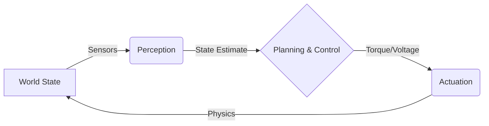

# What is Physical AI?

> **Why this matters:** Physical AI is the bridge between digital intelligence and the physical world. Unlike pure software AI (Chatbots, Image Generators), Physical AI must deal with gravity, inertia, friction, and the unforgiving reality of physics.

## The Perception-Actuation Loop

At its core, a Physical AI system operates in a continuous loop. It is not just "input -> output", but "observation -> action -> state change -> observation".

### Key Components

1.  **Perception**: Converting raw sensor data (pixels, currents, lidar points) into a semantic understanding of the world.
2.  **Planning**: Deciding _what_ to do next (e.g., "Step forward", "Grab the cup").
3.  **Control**: Deciding _how_ to execute that plan (e.g., "Apply 5Nm torque to knee joint").

## Embodied Intelligence

Physical AI implies **embodiment**. The intelligence is constrained by the body. A 50kg robot cannot stop instantly. A hand with 3 fingers grasps differently than one with 5. The software must understand the hardware.

### Common Pitfalls

- **Latency Ignoring**: In software, a 500ms delay is annoying. In robotics, it causes falling over.
- **Model Mismatch**: Your physics simulation is never 100% accurate to the real world.
- **Safety**: A bad LLM output prints text. A bad robot output breaks a leg (or yours).

## Key Takeaways

- Physical AI closes the loop between bits and atoms.
- Latency and physics are hard constraints, not just optimization targets.
- The body and the brain must be co-designed.
