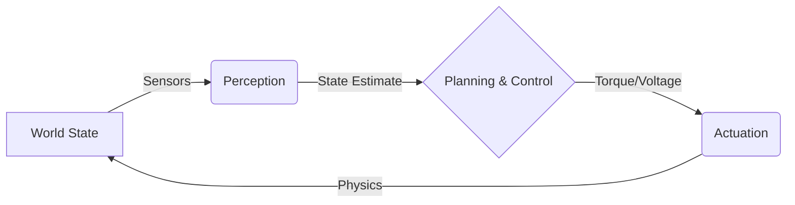
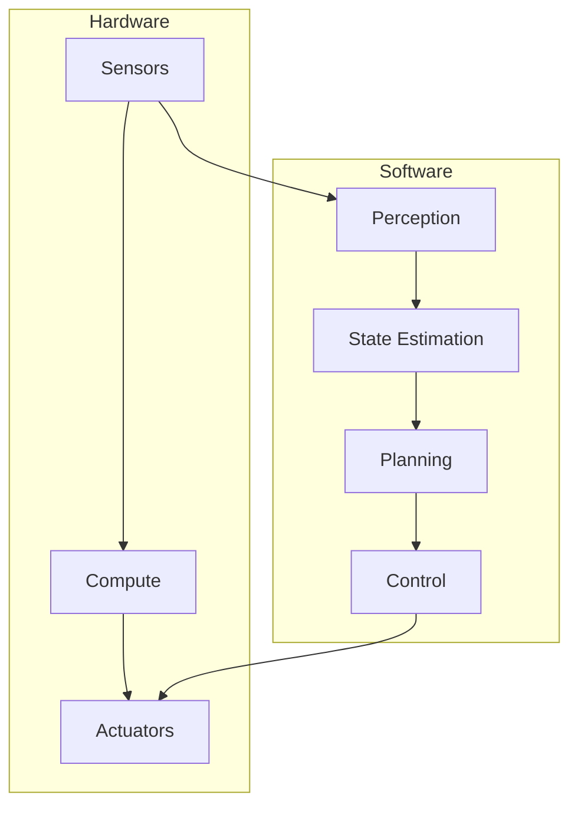

# What is Physical AI?


> **Why this matters:** Physical AI is the bridge between digital intelligence and the physical world. Unlike pure software AI (Chatbots, Image Generators), Physical AI must deal with gravity, inertia, friction, and the unforgiving reality of physics.

## Introduction: Beyond the Screen

Imagine asking ChatGPT to make you a cup of coffee. It can tell you the steps, recommend beans, even write a Python script for an espresso machine. But it cannot _physically_ pick up the cup. That's the domain of **Physical AI**.

Physical AI represents the convergence of machine learning, robotics, and control theory to create systems that can:

- **Perceive** the real world through sensors
- **Reason** about physical interactions
- **Act** on the environment through actuators
- **Learn** from physical experience

:::tip Key Insight
The fundamental difference between software AI and physical AI is **embodiment**. A physical AI system has a body, and that body constrains what it can do.
:::

---

## The Perception-Actuation Loop

At its core, a Physical AI system operates in a continuous loop. It is not just "input -> output", but "observation -> action -> state change -> observation".



This loop runs continuously, often at frequencies of 100Hz to 1000Hz. Every millisecond matters.

### The Three Pillars of Physical AI

| Pillar         | Description                                            | Example                    |
| -------------- | ------------------------------------------------------ | -------------------------- |
| **Perception** | Converting raw sensor data into semantic understanding | "There's a table 2m ahead" |
| **Planning**   | Deciding what to do next                               | "Walk around the table"    |
| **Control**    | Executing the plan with precise actuation              | "Apply 5Nm to left knee"   |


---

## Why Physical AI is Hard

### 1. The Reality Gap

In simulation, your robot never slips. In reality, a tiny oil spot can cause catastrophic failure. This gap between simulation and reality is one of the biggest challenges in robotics.

```python
# Simulation vs Reality
simulation_friction = 0.8  # Perfect coefficient
reality_friction = 0.3 + random.uniform(-0.2, 0.2)  # Unpredictable
```

### 2. Latency Kills

In software, a 500ms delay is annoying. In robotics, it causes falling over. Physical AI systems must react in **real-time**.

| System        | Acceptable Latency |
| ------------- | ------------------ |
| Web App       | 500ms              |
| Video Game    | 16ms (60 FPS)      |
| Robot Balance | 1-5ms              |
| Robot Reflex  | under 1ms          |

### 3. Safety is Non-Negotiable

A bad LLM output prints text. A bad robot output breaks a leg (or yours). Physical AI requires robust safety systems.

:::warning Critical
Every Physical AI system must have multiple safety layers: software limits, hardware limits, and physical emergency stops.
:::

---

## Embodied Intelligence

Physical AI implies **embodiment**. The intelligence is constrained by the body. A 50kg robot cannot stop instantly. A hand with 3 fingers grasps differently than one with 5.


### The Body Shapes the Mind

Consider two robots:

1. **Spot** (Boston Dynamics): 4 legs, low center of gravity, extremely stable
2. **Atlas** (Boston Dynamics): 2 legs, high center of gravity, requires constant balance

The control algorithms for these robots are fundamentally different because their bodies are different. The software and hardware must be **co-designed**.

---

## Real-World Examples

### Tesla Optimus

Tesla's humanoid robot, Optimus (formerly Tesla Bot), represents the automotive industry's entry into humanoid robotics. Key specifications:

- Height: 5'8" (173 cm)
- Weight: 125 lbs (57 kg)
- Payload: 45 lbs (20 kg)
- Speed: 5 mph (8 km/h)

### Boston Dynamics Atlas

The gold standard in dynamic humanoid locomotion. Atlas can:

- Run at 5.4 mph
- Jump over obstacles
- Perform backflips
- Recover from pushes

### Figure 01

The newest entrant in the humanoid race, backed by major tech investors. Figure 01 focuses on:

- General-purpose manipulation
- Learning from demonstration
- Safe human-robot interaction

---

## The Technology Stack



### Sensors

- **Cameras**: Visual perception (RGB, stereo, depth)
- **LiDAR**: 3D point cloud for mapping
- **IMU**: Inertial measurement for balance
- **Force/Torque**: Contact sensing
- **Encoders**: Joint position feedback

### Compute

- **Edge TPUs**: Neural network inference
- **FPGAs**: Real-time control loops
- **GPUs**: Perception processing
- **CPUs**: Planning and coordination

### Actuators

- **Electric Motors**: Precise, clean, efficient
- **Hydraulics**: High power-to-weight ratio
- **Pneumatics**: Soft, compliant movements

---

## Key Takeaways

:::note Summary

1. **Physical AI closes the loop** between bits and atoms
2. **Latency and physics** are hard constraints, not optimization targets
3. **The body and the brain** must be co-designed
4. **Safety** is paramount in every design decision
5. **The reality gap** remains the biggest engineering challenge
   :::

---

## Further Reading

- **Chapter 1.2**: [Sensors & State Estimation](/docs/module-01-foundations/sensors-state-estimation) - Deep dive into perception
- **Chapter 2.1**: [Kinematics & Dynamics](/docs/module-02-hardware/kinematics-dynamics) - The math of motion
- **Chapter 3.1**: [ROS 2 Concepts](/docs/module-03-software/ros2-concepts) - The software framework

---

_"The best way to predict the future is to build it." — Abraham Lincoln (probably not, but it applies)_
