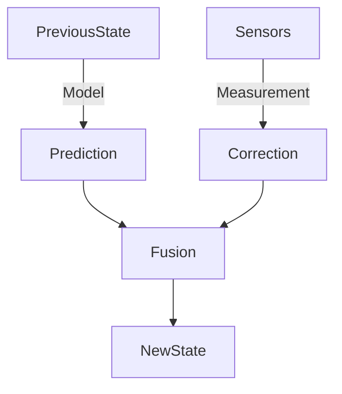

# Sensors & State Estimation

> **Why this matters:** A robot fundamentally does not know where it is. It only knows what its sensors tell it. State estimation is the art of hallucinating the probable truth from noisy, lying sensors.

## The Sensor Suite

Humanoids typically rely on a fusion of sensors:

| Sensor                              | Measures                        | Pros                         | Cons                        |
| :---------------------------------- | :------------------------------ | :--------------------------- | :-------------------------- |
| **IMU** (Inertial Measurement Unit) | Acceleration & Angular Velocity | Fast (1kHz+), Self-contained | Drifts over time            |
| **Encoders**                        | Joint Angles                    | Precise, Direct              | Gear backlash, belt stretch |
| **Vision** (Cameras/Lidar)          | External World                  | Rich semantic data           | Slow (30-60Hz), Occlusions  |
| **Force/Torque**                    | Contact                         | Detecting impact/ground      | Noisy, expensive            |

## State Estimation Basics

We combine these inputs using filters. The most common is the **Kalman Filter** or its variants (Extended/Unscented).

### The Kalman Concept

1.  **Predict**: "Based on my last command, I should be _here_."
2.  **Update**: "My sensors say I am _there_."
3.  **Fusion**: "I trust my prediction 40% and sensors 60%, so I am _somewhere in between_."

## Practical Notes

- **IMU Calibration** is critical. A slight bias makes you think you are tilting when you are standing still.
- **Filtering** introduces delay. A heavy filter smooths noise but makes the robot feel "sluggish" to controllers.

## Key Takeaways

- Sensors are noisy and sometimes wrong.
- Proprioception (internal state) is fast; Exteroception (vision) is slow.
- State Estimation fuses these to guess the "True State".
