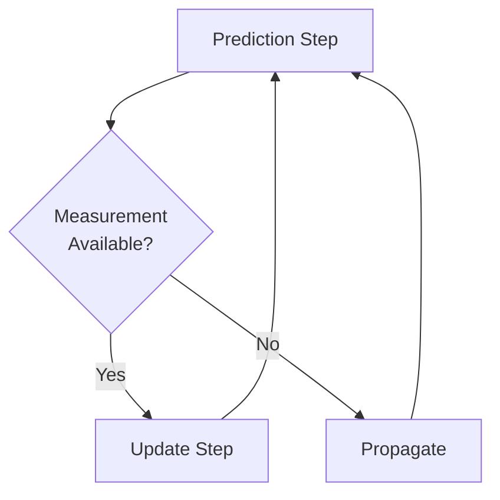
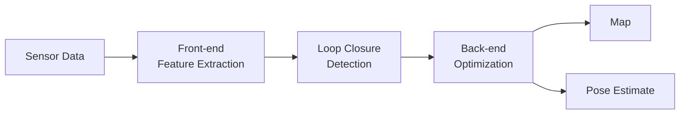

# Sensors & State Estimation


> **Why this matters:** A robot without sensors is blind. State estimation is how robots understand where they are and what's happening around them.

## Introduction: The Robot's Senses

Humans have five senses. Robots can have dozens. From cameras that see in wavelengths invisible to humans, to force sensors that feel pressure at millinewton precision, modern robots are equipped with a sensory arsenal that would make any superhero jealous.

But having sensors is only half the battle. The real challenge is **state estimation**: taking noisy, incomplete sensor data and reconstructing an accurate model of the world.

---

## The Sensor Zoo

### Vision Sensors


| Sensor Type        | Output             | Use Case            |
| ------------------ | ------------------ | ------------------- |
| RGB Camera         | Color image        | Object detection    |
| Stereo Camera      | Depth + RGB        | 3D reconstruction   |
| Depth Camera (ToF) | Point cloud        | Obstacle avoidance  |
| Thermal Camera     | Heat map           | Human detection     |
| Event Camera       | Brightness changes | High-speed tracking |

### Inertial Sensors

The **IMU (Inertial Measurement Unit)** is the inner ear of a robot:

```python
class IMU:
    def read(self):
        return {
            "acceleration": [ax, ay, az],  # m/s²
            "angular_velocity": [wx, wy, wz],  # rad/s
            "magnetometer": [mx, my, mz]  # µT
        }
```

:::tip Pro Tip
High-end IMUs can detect accelerations as small as 0.001g and angular velocities of 0.001°/s.
:::

### Force & Torque Sensors

Critical for manipulation and safe interaction:

- **6-axis F/T sensors**: Measure forces and torques in all directions
- **Tactile sensors**: Arrays of pressure-sensitive elements
- **Joint torque sensors**: Measure load at each joint

---

## State Estimation Fundamentals

### The Estimation Problem

Given:

- Noisy sensor measurements
- An approximate model of robot dynamics
- Previous state estimates

Find:

- The current state (position, velocity, orientation)
- Uncertainty bounds

### The Kalman Filter Family

The workhorse of state estimation is the **Kalman Filter**:



#### Extended Kalman Filter (EKF)

For nonlinear systems:

```
x_hat[k|k] = x_hat[k|k-1] + K_k * (z_k - h(x_hat[k|k-1]))
```

Where:

- `x_hat` = state estimate
- `K_k` = Kalman gain
- `z_k` = measurement
- `h()` = measurement function

---

## Sensor Fusion

No single sensor is perfect. **Sensor fusion** combines multiple sensors to get the best of all worlds.

### Example: Robot Localization

| Sensor         | Strength                       | Weakness                 |
| -------------- | ------------------------------ | ------------------------ |
| GPS            | Absolute position              | 2-5m error, indoor fails |
| IMU            | High rate, no drift short-term | Long-term drift          |
| LiDAR          | Precise distance               | Expensive, heavy         |
| Wheel Odometry | Simple, cheap                  | Slip causes error        |

The fusion algorithm weighs each sensor based on:

1. Current confidence
2. Environmental conditions
3. Sensor health


---

## SLAM: Simultaneous Localization and Mapping

The ultimate sensor fusion problem: building a map while simultaneously figuring out where you are in that map.



### Types of SLAM

- **Visual SLAM**: Uses cameras (ORB-SLAM, RTAB-Map)
- **LiDAR SLAM**: Uses laser scanners (Cartographer, LIO-SAM)
- **Hybrid**: Combines multiple sensors (LeGO-LOAM, LVI-SAM)

---

## Practical Implementation

### ROS 2 Sensor Interface

```cpp
// Subscribing to IMU data in ROS 2
auto imu_sub = node->create_subscription<sensor_msgs::msg::Imu>(
    "/imu/data",
    10,
    [this](const sensor_msgs::msg::Imu::SharedPtr msg) {
        // Process IMU data
        auto orientation = msg->orientation;
        auto angular_vel = msg->angular_velocity;
        auto linear_acc = msg->linear_acceleration;
    }
);
```

### Calibration is Critical

:::warning Never Skip Calibration
A 1° error in IMU alignment can cause meters of drift over minutes. Always perform:

1. Intrinsic calibration (sensor-specific parameters)
2. Extrinsic calibration (sensor-to-robot transform)
3. Time synchronization across all sensors
   :::

---

## Key Takeaways

:::note Summary

1. **Sensors are the eyes and ears** of Physical AI systems
2. **State estimation** turns noisy data into actionable knowledge
3. **Sensor fusion** combines strengths and mitigates weaknesses
4. **SLAM** is the crown jewel of perception algorithms
5. **Calibration** is not optional—it's foundational
   :::

---

## Further Reading

- **Chapter 1.1**: [What is Physical AI?](/docs/module-01-foundations/what-is-physical-ai)
- **Chapter 1.3**: [Simulation Basics](/docs/module-01-foundations/simulation-basics)
- **Chapter 3.3**: [Perception Systems](/docs/module-03-software/perception)
