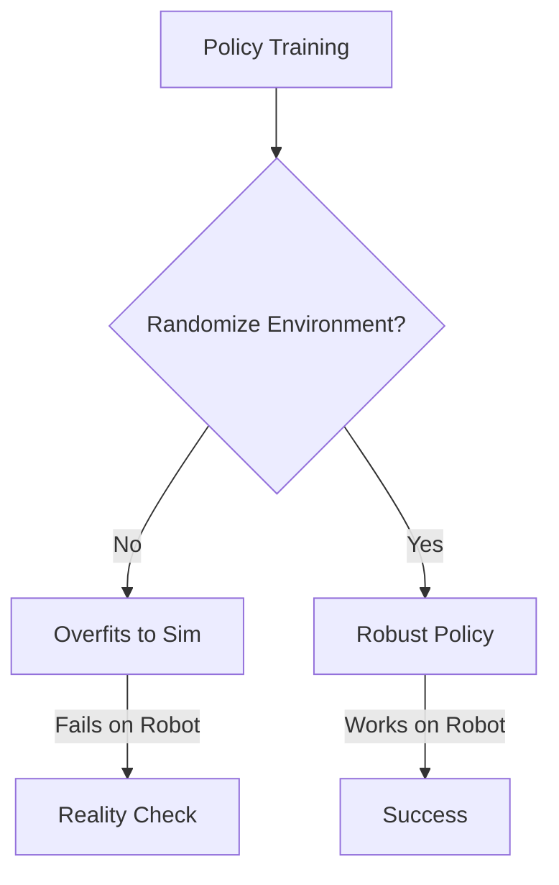

# Simulation Basics & Sim-to-Real Overview

> **Why this matters:** Hardware is expensive and breaks easily. Training a walking policy on a real robot means fixing broken gears every 5 minutes. Simulation allows millions of failures safely.

## The Simulation Landscape

Popular simulators for Humanoids:

- **MuJoCo**: The gold standard for contact physics. Fast, stable.
- **Isaac Sim (NVIDIA)**: Photorealistic, GPU-accelerated massive parallel training.
- **Gazebo**: Classic, great for ROS integration, but can be unstable for complex contacts.

## The Reality Gap

The "Sim-to-Real" gap is the difference between how your robot behaves in code vs. reality.

**Sources of Gap:**

1.  **Friction**: Extremely hard to model perfectly.
2.  **Actuator Dynamics**: Motors don't respond instantly.
3.  **Latency**: Simulators usually run instantaneously; reality has delays.

## Domain Randomization

To cross the gap, we use **Domain Randomization**.

> Instead of trying to model the world perfectly, we model thousands of _slightly wrong_ worlds.

If your policy can walk on ice, mud, and carpet in sim (represented by varying friction coefficients), it has a better chance of walking on the real floor.

## Key Takeaways

- Simulation is mandatory for modern learning-based control.
- The Reality Gap is the enemy.
- Randomize physics parameters during training to build robustness.
