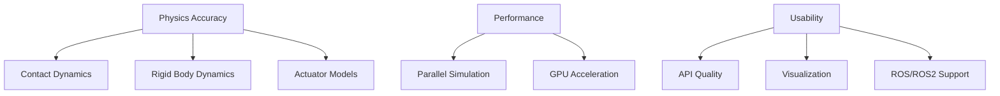
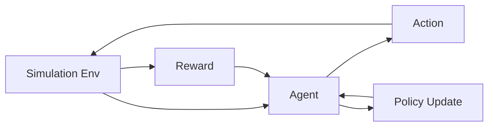

# Simulation Basics


> **Why this matters:** You don't test your robot's walking algorithm by throwing it down the stairs. Simulation lets you fail fast, fail safely, and iterate rapidly.

## Introduction: The Digital Sandbox

Before a single motor turns, before a single wire is connected, the robot lives in simulation. This digital twin allows engineers to:

- **Test algorithms** without breaking hardware
- **Generate training data** for machine learning
- **Validate safety** before real-world deployment
- **Iterate rapidly** on designs

:::tip Industry Secret
Tesla's Optimus team runs millions of simulation steps before any code touches the real robot. The cost of a virtual failure is zero. The cost of a real failure is a broken robot and a delayed schedule.
:::

---

## Physics Engines: The Heart of Simulation

### Popular Physics Engines

| Engine               | Strengths                       | Used By           |
| -------------------- | ------------------------------- | ----------------- |
| **MuJoCo**           | Fast, accurate contact          | DeepMind, OpenAI  |
| **PyBullet**         | Free, easy to use               | Academic research |
| **NVIDIA Isaac Sim** | GPU-accelerated, photorealistic | Nvidia partners   |
| **Gazebo**           | ROS integration, modular        | ROS community     |
| **Unity/PhysX**      | Game-quality graphics           | VR/AR robotics    |


### What Makes a Good Simulator?



---

## The Sim-to-Real Gap

The biggest challenge in simulation is the **reality gap**. No simulation is perfect.

### Sources of Error

1. **Contact dynamics**: Friction, deformation, slip
2. **Actuator models**: Motor dynamics, delays, saturation
3. **Sensor noise**: Real sensors are noisy; simulated sensors often aren't
4. **Unmodeled dynamics**: Cables, air resistance, temperature effects

### Bridging the Gap

#### Domain Randomization

Train on varied simulation conditions so the algorithm is robust to reality:

```python
def randomize_domain(env):
    # Randomize physics parameters
    env.friction = np.random.uniform(0.5, 1.5)
    env.mass = base_mass * np.random.uniform(0.8, 1.2)
    env.motor_strength = np.random.uniform(0.9, 1.1)

    # Randomize sensor noise
    env.camera_noise = np.random.uniform(0, 0.1)
    env.imu_bias = np.random.normal(0, 0.01, size=6)
```

#### System Identification

Measure real robot parameters and update simulation:

```
theta* = argmin_theta sum_t ||x_sim(t; theta) - x_real(t)||^2
```

---

## Setting Up Your First Simulation

### MuJoCo Example

```python
import mujoco
import mujoco.viewer

# Load the model
model = mujoco.MjModel.from_xml_path('humanoid.xml')
data = mujoco.MjData(model)

# Run simulation with viewer
with mujoco.viewer.launch_passive(model, data) as viewer:
    while viewer.is_running():
        mujoco.mj_step(model, data)
        viewer.sync()
```

### Gazebo + ROS 2 Example

```bash
# Launch a robot simulation in Gazebo
ros2 launch my_robot_gazebo robot_simulation.launch.py

# In another terminal, see the robot state
ros2 topic echo /robot_state
```

---

## Training Robots in Simulation

### Reinforcement Learning Pipeline



### Massive Parallelization

Modern approaches run thousands of simulations in parallel:

| Approach     | Simulations/Second | Hardware    |
| ------------ | ------------------ | ----------- |
| CPU single   | 100                | 1 core      |
| CPU parallel | 1,000              | 32 cores    |
| GPU parallel | 100,000+           | NVIDIA A100 |


---

## Best Practices

### 1. Start Simple

```python
# BAD: Start with full humanoid
sim = FullHumanoidSimulation(45_joints, 100_sensors)

# GOOD: Start with simple model
sim = InvertedPendulum(1_joint, 2_sensors)
```

### 2. Validate Early and Often

:::warning Reality Check
Every 1-2 weeks, test your algorithm on the real robot. Don't wait until "it's ready." Early reality checks save months of wasted simulation time.
:::

### 3. Log Everything

```python
import wandb

wandb.init(project="humanoid-walking")
wandb.log({
    "episode_reward": total_reward,
    "success_rate": successes / episodes,
    "sim_steps": total_steps
})
```

---

## Key Takeaways

:::note Summary

1. **Simulation is essential** for safe, rapid iteration
2. **The reality gap** is the main challenge
3. **Domain randomization** makes policies robust
4. **GPU parallelization** enables massive-scale training
5. **Validate early** with real hardware
   :::

---

## Further Reading

- **Chapter 1.2**: [Sensors & State Estimation](/docs/module-01-foundations/sensors-state-estimation)
- **Chapter 4.1**: [Digital Twins](/docs/module-04-deployment/digital-twins)
- **Chapter 3.2**: [Control Stack](/docs/module-03-software/control-stack)
