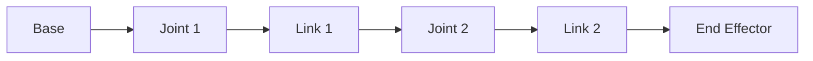
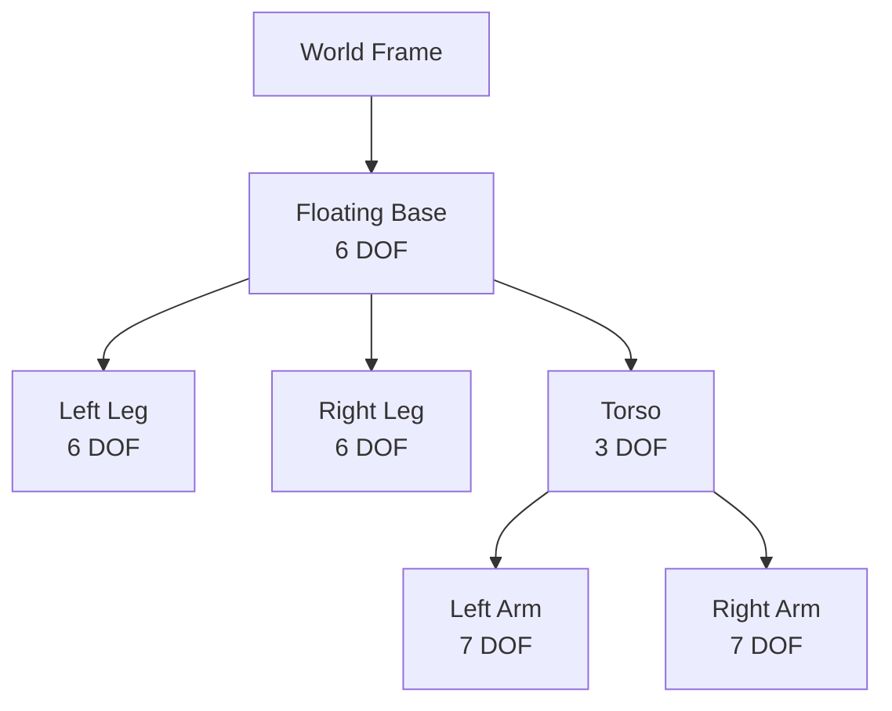

# Kinematics & Dynamics


> **Why this matters:** Before you can make a robot move, you need to understand _how_ it moves. Kinematics is the geometry of motion. Dynamics adds forces and torques.

## Introduction: The Mathematics of Movement

Every movement a robot makes—from picking up a cup to walking across a room—is governed by kinematics and dynamics. These are not abstract mathematical concepts; they are the toolbox every robotics engineer uses daily.

---

## Forward Kinematics

**Question**: Given joint angles, where is the end effector?

### The Kinematic Chain



### Transformation Matrices

Each joint adds a transformation:

```
T_end = T_1 × T_2 × T_3 × ... × T_n
```

For a rotation about the z-axis:

```
R_z(θ) = | cos(θ)  -sin(θ)  0 |
         | sin(θ)   cos(θ)  0 |
         |   0        0     1 |
```

### Implementation

```python
import numpy as np

def forward_kinematics(joint_angles, link_lengths):
    """
    Calculate end effector position from joint angles.
    """
    x, y = 0, 0
    angle_sum = 0

    for theta, length in zip(joint_angles, link_lengths):
        angle_sum += theta
        x += length * np.cos(angle_sum)
        y += length * np.sin(angle_sum)

    return x, y, angle_sum
```


---

## Inverse Kinematics

**Question**: Given a target position, what joint angles get us there?

### The Challenge

Inverse kinematics (IK) is harder than forward kinematics:

- **Non-unique solutions**: Multiple joint configurations can reach the same point
- **Unreachable targets**: Some positions are outside the workspace
- **Singularities**: Configurations where the math breaks down

### Analytical vs. Numerical IK

| Approach       | Pros                | Cons                         |
| -------------- | ------------------- | ---------------------------- |
| **Analytical** | Fast, exact         | Only works for simple chains |
| **Numerical**  | Works for any robot | Slower, may not converge     |

### Jacobian-Based IK

The Jacobian relates joint velocities to end effector velocities:

```
ẋ = J(θ) × θ̇
```

To solve IK iteratively:

```
Δθ = J⁻¹ × Δx
```

:::warning Singularities
When `det(J) = 0`, the robot is in a singularity. The arm is either fully extended or folded in a way that makes certain movements impossible.
:::

---

## Dynamics: Adding Forces

Kinematics tells you _where_ things go. Dynamics tells you _what forces_ are needed.

### The Equations of Motion

For a robot with n joints:

```
M(θ)×θ̈ + C(θ,θ̇)×θ̇ + G(θ) = τ
```

Where:

- `M(θ)` = Mass/inertia matrix
- `C(θ,θ̇)` = Coriolis/centrifugal terms
- `G(θ)` = Gravity terms
- `τ` = Joint torques

### Inverse Dynamics

Used in computed torque control:

```python
def inverse_dynamics(q, dq, ddq, robot_model):
    """
    Calculate required torques for desired motion.
    """
    M = robot_model.mass_matrix(q)
    C = robot_model.coriolis_matrix(q, dq)
    G = robot_model.gravity_vector(q)

    return M @ ddq + C @ dq + G
```


---

## Humanoid Specifics

Humanoids are not just more complex robot arms—they have unique challenges.

### Floating Base

Unlike a fixed arm, a humanoid's base (pelvis) moves freely:



Total: **35+ degrees of freedom**

### Center of Mass

The CoM must stay above the support polygon:

```
x_CoM = Σ(m_i × x_i) / Σ(m_i)
```

| Stance         | Support Polygon  |
| -------------- | ---------------- |
| Double support | Large rectangle  |
| Single support | Small foot shape |
| Mid-swing      | Very small       |

---

## Tools & Libraries

### Pinocchio (C++/Python)

Industry-standard for rigid body dynamics:

```python
import pinocchio as pin

# Load robot model
model = pin.buildModelFromUrdf("humanoid.urdf")
data = model.createData()

# Compute kinematics
pin.forwardKinematics(model, data, q)
pin.updateFramePlacements(model, data)

# Get end effector position
ee_pos = data.oMf[frame_id].translation
```

### Drake (C++)

Google's robotics toolkit:

```cpp
MultibodyPlant<double> plant;
Parser(&plant).AddModelFromFile("robot.sdf");
plant.Finalize();

auto context = plant.CreateDefaultContext();
plant.SetPositions(context.get(), q);
```

---

## Key Takeaways

:::note Summary

1. **Forward kinematics** maps joint angles to end effector pose
2. **Inverse kinematics** maps target pose to joint angles
3. **Dynamics** adds forces, masses, and accelerations
4. **The Jacobian** connects joint and Cartesian velocities
5. **Humanoids** add complexity with floating bases and many DOFs
   :::

---

## Further Reading

- **Chapter 2.2**: [Actuation & Control](/docs/module-02-hardware/actuation-control)
- **Chapter 2.3**: [Locomotion & Balance](/docs/module-02-hardware/locomotion-balance)
- **Chapter 3.2**: [Control Stack](/docs/module-03-software/control-stack)
