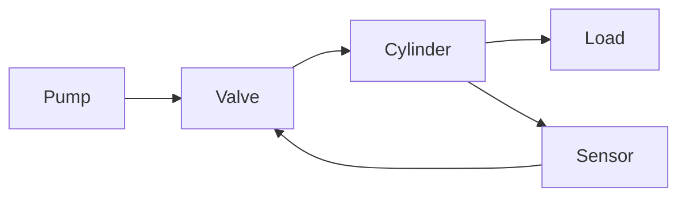
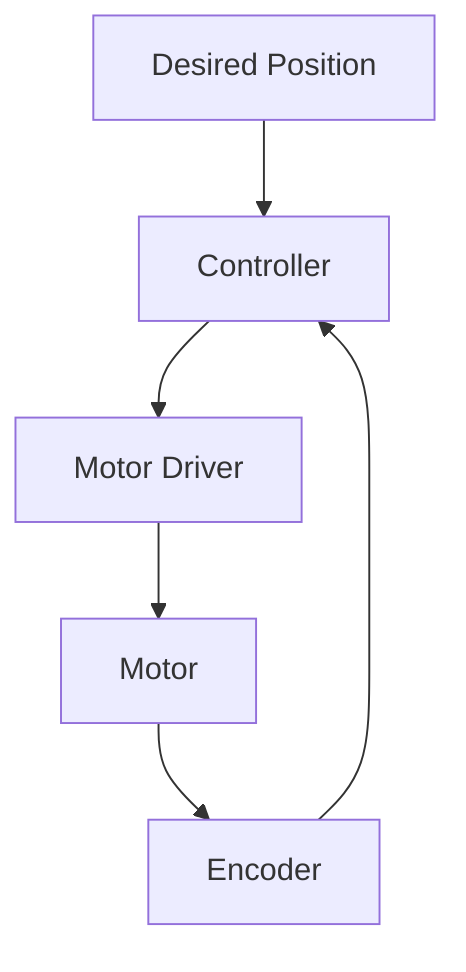

# Actuation & Control


> **Why this matters:** Actuators are the muscles of a robot. Without precise control of these muscles, even the best planning algorithm is useless.

## Introduction: Turning Electrons into Motion

The journey from "robot, walk forward" to actual walking involves converting digital commands into physical force. This is the domain of actuation and control.

---

## Types of Actuators

### Electric Motors

The most common actuator in modern robots.

| Type         | Torque | Speed      | Efficiency | Use Case              |
| ------------ | ------ | ---------- | ---------- | --------------------- |
| Brushed DC   | Low    | High       | 70-80%     | Hobby robots          |
| Brushless DC | High   | Very High  | 85-95%     | Drones, EVs           |
| Servo        | Medium | Controlled | 80-90%     | Arms, legs            |
| Stepper      | Medium | Low        | 60-70%     | Precision positioning |


### Hydraulic Actuators

High power-to-weight ratio, but complex:



Used in: Boston Dynamics Atlas (original), heavy industrial robots

### Pneumatic Actuators

Soft, compliant, safe for human interaction:

- Artificial muscles
- Soft grippers
- Collaborative robots

---

## Motor Control Fundamentals

### The Control Loop

Every actuator has a control loop:



### PID Control

The workhorse of motor control:

```
u(t) = Kp×e(t) + Ki×∫e(t)dt + Kd×de(t)/dt
```

```python
class PIDController:
    def __init__(self, kp, ki, kd):
        self.kp, self.ki, self.kd = kp, ki, kd
        self.integral = 0
        self.prev_error = 0

    def update(self, error, dt):
        self.integral += error * dt
        derivative = (error - self.prev_error) / dt
        self.prev_error = error

        return (self.kp * error +
                self.ki * self.integral +
                self.kd * derivative)
```

### Tuning PID

| Parameter | Too Low            | Too High            |
| --------- | ------------------ | ------------------- |
| `Kp`      | Slow response      | Oscillation         |
| `Ki`      | Steady-state error | Overshoot, windup   |
| `Kd`      | Overshoot          | Noise amplification |

:::tip Ziegler-Nichols Method

1. Set `Ki = Kd = 0`
2. Increase `Kp` until oscillation
3. Record critical gain `Kc` and period `Tc`
4. Set: `Kp = 0.6Kc`, `Ki = 1.2Kc/Tc`, `Kd = 0.075Kc×Tc`
   :::

---

## Advanced Control Techniques

### Impedance Control

Instead of controlling position, control the _relationship_ between force and motion:

```
M×ẍ + D×ẋ + K×x = F_ext
```

Makes the robot feel like a spring-damper system to external forces.

### Model Predictive Control (MPC)

Optimize over a horizon of future states:

```python
def mpc_step(current_state, reference_trajectory):
    # Define optimization problem
    problem = cp.Problem(
        cp.Minimize(
            sum([stage_cost(x[t], u[t], ref[t])
                 for t in range(horizon)])
        ),
        constraints=[
            x[t+1] == dynamics(x[t], u[t]),
            u_min <= u[t] <= u_max,
            x[0] == current_state
        ]
    )
    problem.solve()
    return u[0].value  # Apply first control
```


---

## Humanoid-Specific Considerations

### Compliance vs. Stiffness

| Mode           | When to Use         | Example            |
| -------------- | ------------------- | ------------------ |
| High stiffness | Precise positioning | Picking up a glass |
| Low stiffness  | Unknown environment | Opening a door     |
| Variable       | Contact transitions | Walking            |

### Series Elastic Actuators (SEA)

Add a spring between motor and load:

Advantages:

- Better force control
- Energy storage for explosive movements
- Safer human interaction

Used in: Atlas, Digit, many research robots

### Quasi-Direct Drive

Minimize gear ratio for backdrivability:

- Low friction
- High bandwidth
- Excellent force sensing

Used in: MIT Cheetah, Berkeley Blue

---

## Power Systems

### Battery Technology

| Chemistry  | Energy Density | Power Density | Cycle Life |
| ---------- | -------------- | ------------- | ---------- |
| LiFePO4    | Medium         | Very High     | 2000+      |
| Li-ion NMC | High           | High          | 500-1000   |
| Li-Po      | High           | Very High     | 300-500    |

:::warning Thermal Management
Actuators and batteries generate heat. A 30% efficiency motor operating at 500W produces 150W of heat. Plan for cooling!
:::

---

## Key Takeaways

:::note Summary

1. **Electric motors** dominate modern robotics
2. **PID control** is the foundation, but not always enough
3. **Impedance control** enables safe interaction
4. **MPC** optimizes over future trajectories
5. **Compliance** (SEAs, QDD) is critical for dynamic robots
   :::

---

## Further Reading

- **Chapter 2.1**: [Kinematics & Dynamics](/docs/module-02-hardware/kinematics-dynamics)
- **Chapter 2.3**: [Locomotion & Balance](/docs/module-02-hardware/locomotion-balance)
- **Chapter 3.2**: [Control Stack](/docs/module-03-software/control-stack)
