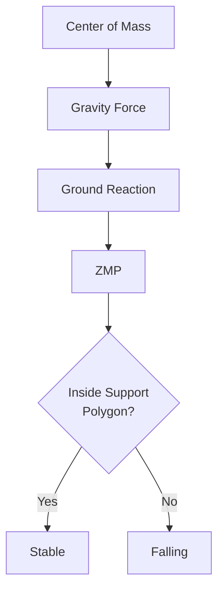
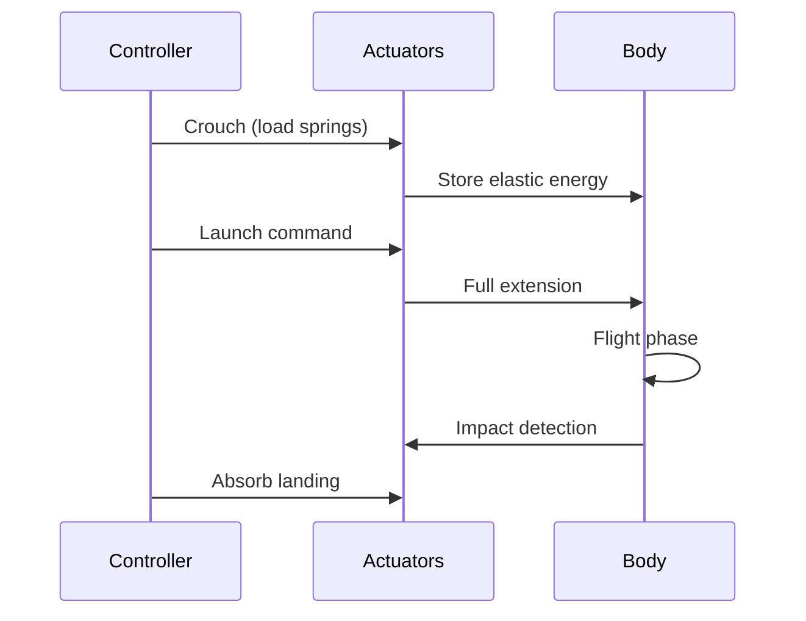

# Locomotion & Balance


> **Why this matters:** Walking is not falling down. It's controlled falling, caught just in time. This chapter covers the art and science of making robots walk.

## Introduction: The Art of Not Falling

Humans learn to walk in about a year. Engineers have spent 50+ years trying to replicate it in robots. Walking is hard because it requires:

- **Balance**: Keeping the center of mass supported
- **Dynamics**: Managing momentum and impact
- **Adaptability**: Handling uneven terrain, stairs, and surprises

---

## Balance Fundamentals

### Center of Mass (CoM)

The point where all mass can be considered concentrated:

```
r_CoM = Σ(m_i × r_i) / Σ(m_i)
```

### Zero Moment Point (ZMP)

The point on the ground where reaction forces create zero moment:



:::tip The ZMP Rule
If ZMP is inside the support polygon (foot outline), the robot won't tip over. If it's outside, gravity wins.
:::


---

## Walking Gaits

### Phases of Walking

| Phase              | Description         | Duration |
| ------------------ | ------------------- | -------- |
| **Double Support** | Both feet on ground | 10-15%   |
| **Single Support** | One foot on ground  | 35-40%   |
| **Swing**          | Foot in air         | 35-40%   |

### Gait Generation Methods

#### 1. ZMP-Based Planning

Classic approach (Honda ASIMO, early humanoids):

```python
def plan_zmp_trajectory(footsteps, duration):
    zmp_traj = []
    for step in footsteps:
        # ZMP moves from one foot to the other
        zmp_traj.extend(interpolate(
            current_foot.center,
            next_foot.center,
            duration
        ))
    return zmp_traj
```

#### 2. Capture Point / DCM

More dynamic approach, used in modern robots:

```
ξ = x + ẋ / ω_0
```

Where `ω_0 = sqrt(g / z_CoM)` is the natural frequency.

The capture point is where the robot _would_ stop if it put its foot there immediately.

#### 3. Reinforcement Learning

Train end-to-end policies in simulation:

```python
reward = (
    forward_velocity_reward
    - energy_penalty
    - falling_penalty
    + alive_bonus
)
```


---

## Dynamic Maneuvers

### Running

Running differs from walking in that both feet leave the ground:

| Walking                    | Running                 |
| -------------------------- | ----------------------- |
| Always one foot down       | Flight phase            |
| CoM nearly constant height | CoM bounces             |
| Lower impact forces        | 2-3x body weight impact |

### Jumping

Requires explosive actuation and precise timing:



### Push Recovery

When pushed, the robot must react:

1. **Ankle strategy**: Small pushes, stiff ankles
2. **Hip strategy**: Medium pushes, bend at hip
3. **Step strategy**: Large pushes, take a step

---

## Terrain Adaptation

### Uneven Ground

Robots must handle:

- Slopes
- Steps and stairs
- Loose surfaces (gravel, grass)
- Unexpected obstacles

### State Machine Approach

```python
class TerrainStateMachine:
    states = {
        "FLAT_GROUND": FlatGroundController(),
        "STAIRS_UP": StairsUpController(),
        "STAIRS_DOWN": StairsDownController(),
        "SLOPE": SlopeController(),
        "ROUGH": RoughTerrainController()
    }

    def update(self, perception):
        detected_terrain = self.classify_terrain(perception)
        self.transition_to(detected_terrain)
        return self.current_state.compute_action()
```

---

## Case Studies

### Boston Dynamics Atlas

The most dynamic humanoid in the world:

- Hydraulic actuation
- ZMP + MPC control
- Can run, jump, do backflips
- 80kg, 1.5m tall

### Tesla Optimus

Electric actuation, designed for manufacturing:

- 28 actuators
- Target: Safe human-speed walking
- Focus on manipulation over acrobatics

### Agility Robotics Digit

Purpose-built for logistics:

- Electric series-elastic actuators
- 4 DoF per leg
- Can carry boxes, climb stairs

---

## Key Takeaways

:::note Summary

1. **Balance** is about keeping ZMP in the support polygon
2. **Walking** is controlled falling
3. **Running** adds a flight phase
4. **Capture point** methods enable dynamic walking
5. **Terrain adaptation** requires perception + control
   :::

---

## Further Reading

- **Chapter 2.1**: [Kinematics & Dynamics](/docs/module-02-hardware/kinematics-dynamics)
- **Chapter 2.2**: [Actuation & Control](/docs/module-02-hardware/actuation-control)
- **Chapter 3.1**: [ROS 2 Concepts](/docs/module-03-software/ros2-concepts)
