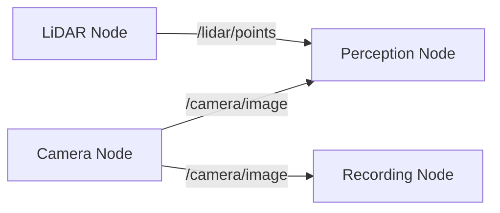
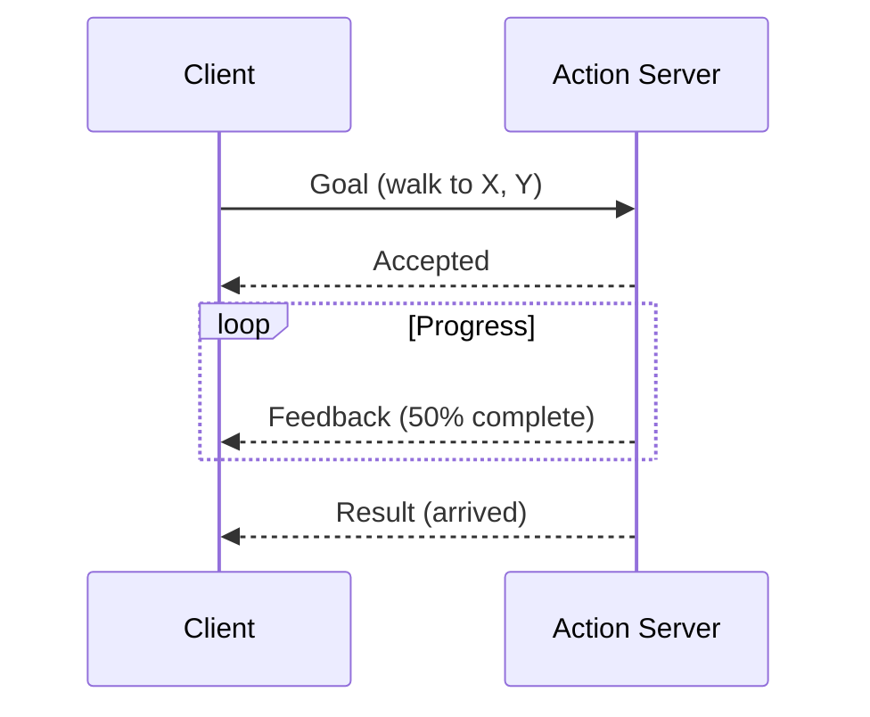

# ROS 2 Concepts


> **Why this matters:** ROS 2 is the lingua franca of robotics software. Understanding it is essential for any serious robotics engineer.

## Introduction: The Robot Operating System

Despite its name, ROS (Robot Operating System) is not an operating system. It's a **middleware framework** that provides:

- **Communication**: Publish-subscribe messaging between processes
- **Hardware abstraction**: Standardized sensor/actuator interfaces
- **Tools**: Visualization, simulation, logging
- **Ecosystem**: Thousands of open-source packages

:::tip History
ROS 1 was created at Willow Garage in 2007. ROS 2 was rebuilt from scratch starting in 2014 for real-time, multi-robot, and industrial use.
:::

---

## Core Concepts

### Nodes

The basic unit of computation in ROS 2. Each node is a process that does one thing well.

```python
import rclpy
from rclpy.node import Node

class MinimalNode(Node):
    def __init__(self):
        super().__init__('minimal_node')
        self.get_logger().info('Hello, ROS 2!')

def main():
    rclpy.init()
    node = MinimalNode()
    rclpy.spin(node)
    rclpy.shutdown()
```

### Topics

Publish-subscribe channels for streaming data:



### Services

Request-response for one-time queries:

```python
# Service server
@self.create_service(SetMode, 'set_mode', self.set_mode_callback)

# Service client
future = self.cli.call_async(SetMode.Request(mode='WALKING'))
```

### Actions

Long-running tasks with feedback:




---

## Data Flow

### Message Types

Standard message definitions:

| Package         | Message    | Contents                  |
| --------------- | ---------- | ------------------------- |
| `sensor_msgs`   | `Image`    | RGB/Depth camera data     |
| `sensor_msgs`   | `Imu`      | Accelerometer + Gyro      |
| `geometry_msgs` | `Twist`    | Linear + Angular velocity |
| `nav_msgs`      | `Odometry` | Pose + Velocity           |
| `std_msgs`      | `String`   | Text data                 |

### Custom Messages

```msg
# file: HumanoidState.msg
Header header
float64[] joint_positions
float64[] joint_velocities
geometry_msgs/Pose base_pose
bool is_stable
```

---

## Quality of Service (QoS)

ROS 2 adds QoS policies for real-time and reliability:

| Policy          | Options                    | Use Case                 |
| --------------- | -------------------------- | ------------------------ |
| **Reliability** | RELIABLE / BEST_EFFORT     | Control vs. Video        |
| **Durability**  | TRANSIENT_LOCAL / VOLATILE | Late-joining subscribers |
| **History**     | KEEP_LAST(n) / KEEP_ALL    | Buffer size              |
| **Deadline**    | Duration                   | Real-time guarantees     |

```python
from rclpy.qos import QoSProfile, ReliabilityPolicy

sensor_qos = QoSProfile(
    reliability=ReliabilityPolicy.BEST_EFFORT,
    depth=1
)
control_qos = QoSProfile(
    reliability=ReliabilityPolicy.RELIABLE,
    depth=10
)
```

---

## Launch Files

Orchestrating multiple nodes:

```python
# launch/robot.launch.py
from launch import LaunchDescription
from launch_ros.actions import Node

def generate_launch_description():
    return LaunchDescription([
        Node(
            package='perception',
            executable='camera_node',
            name='front_camera'
        ),
        Node(
            package='control',
            executable='walking_controller',
            parameters=[{'max_speed': 1.0}]
        ),
        Node(
            package='planning',
            executable='path_planner'
        )
    ])
```

---

## Common Tools

### Command Line

```bash
# List all running nodes
ros2 node list

# See topics
ros2 topic list
ros2 topic echo /robot/state

# Call a service
ros2 service call /set_mode std_srvs/srv/SetBool "{data: true}"

# Record data
ros2 bag record -a
```

### Visualization (RViz2)

RViz2 displays:

- Robot model (URDF)
- Sensor data (point clouds, images)
- TF frames (coordinate transforms)
- Paths and markers


---

## ROS 2 vs ROS 1

| Feature        | ROS 1           | ROS 2          |
| -------------- | --------------- | -------------- |
| Communication  | Custom (TCPROS) | DDS standard   |
| Real-time      | Limited         | Supported      |
| Multi-robot    | Difficult       | Native support |
| Windows        | Poor            | Full support   |
| Python version | 2.7             | 3.8+           |
| Lifecycle      | None            | Managed nodes  |

---

## Key Takeaways

:::note Summary

1. **Nodes** are the basic computation units
2. **Topics** enable streaming data (pub-sub)
3. **Services** are request-response
4. **Actions** handle long-running tasks
5. **QoS** provides real-time guarantees
6. **ROS 2** is the modern, production-ready version
   :::

---

## Further Reading

- **Chapter 3.2**: [Control Stack](/docs/module-03-software/control-stack)
- **Chapter 3.3**: [Perception](/docs/module-03-software/perception)
- **Chapter 1.3**: [Simulation Basics](/docs/module-01-foundations/simulation-basics)
