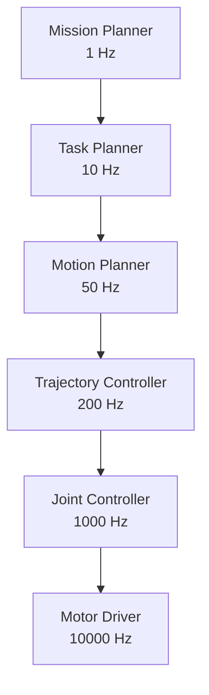
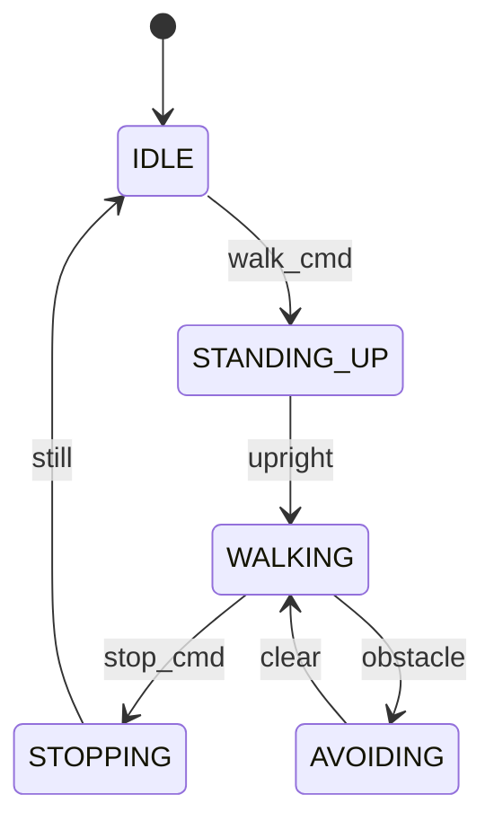
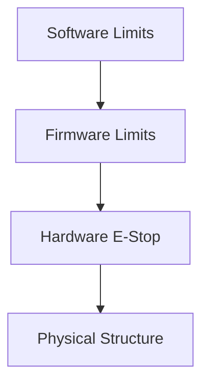

# The Control Stack


> **Why this matters:** The control stack is the nervous system of a robot. It translates high-level commands ("walk forward") into low-level motor commands (torque values every millisecond).

## Introduction: From Intent to Action

When you think "pick up the cup," your brain sends signals through your spinal cord to your muscles. A robot does the same—just with software, math, and electronics.

---

## The Control Hierarchy



| Level      | Frequency   | Responsibility           |
| ---------- | ----------- | ------------------------ |
| Mission    | 0.1-1 Hz    | "Go to kitchen"          |
| Task       | 1-10 Hz     | "Pick up cup, then walk" |
| Motion     | 10-100 Hz   | "Follow this path"       |
| Trajectory | 100-500 Hz  | "Track this curve"       |
| Joint      | 500-2000 Hz | "Servo to this angle"    |

---

## State Machines

Most robot behaviors are organized as state machines:

```python
class RobotStateMachine:
    def __init__(self):
        self.state = 'IDLE'

    def update(self, command, sensors):
        if self.state == 'IDLE':
            if command == 'walk':
                self.state = 'STANDING_UP'

        elif self.state == 'STANDING_UP':
            if sensors.is_upright():
                self.state = 'WALKING'

        elif self.state == 'WALKING':
            if command == 'stop':
                self.state = 'STOPPING'
            if sensors.detected_obstacle():
                self.state = 'AVOIDING'
```




---

## Trajectory Tracking

### Reference Trajectories

A trajectory specifies position, velocity, and acceleration over time:

```
q(t), q̇(t), q̈(t)
```

### Computed Torque Control

Combine inverse dynamics with PD feedback:

```python
def computed_torque_control(q, dq, q_des, dq_des, ddq_des):
    # Position and velocity errors
    e = q_des - q
    de = dq_des - dq

    # Desired acceleration with feedback
    ddq_cmd = ddq_des + Kp @ e + Kd @ de

    # Inverse dynamics
    tau = M @ ddq_cmd + C @ dq + G

    return tau
```

---

## Model Predictive Control (MPC)

The gold standard for complex, constrained systems.

### The Optimization Problem

At each timestep, solve:

```
min sum_{k=0}^{N} ||x_k - x_ref||_Q^2 + ||u_k||_R^2
```

Subject to:

- Dynamics: `x_{k+1} = f(x_k, u_k)`
- Constraints: `u_min ≤ u_k ≤ u_max`

### MPC for Walking

```python
def walking_mpc(com_state, footsteps):
    # Predict CoM trajectory over horizon
    horizon = 1.0  # seconds
    dt = 0.01
    N = int(horizon / dt)

    # Decision variables: CoM jerk
    jerk = cp.Variable((N, 2))

    # Integrate to get position
    com_pos = integrate(com_state, jerk, dt)

    # Objective: track reference + minimize jerk
    objective = cp.Minimize(
        cp.sum_squares(com_pos - ref_pos) +
        0.01 * cp.sum_squares(jerk)
    )

    # Constraint: ZMP in support polygon
    zmp = compute_zmp(com_pos, jerk)
    constraints = [in_polygon(zmp[k], support[k]) for k in range(N)]

    problem = cp.Problem(objective, constraints)
    problem.solve()

    return jerk.value[0]  # Apply first command
```


---

## Safety Systems

### Layered Safety



### Safe Operating Regions

Define where the robot is allowed to be:

```python
class SafetyMonitor:
    def check_limits(self, state):
        # Joint limits
        for i, q in enumerate(state.joint_positions):
            if q < JOINT_MIN[i] or q > JOINT_MAX[i]:
                return SafetyViolation.JOINT_LIMIT

        # Velocity limits
        for i, dq in enumerate(state.joint_velocities):
            if abs(dq) > VELOCITY_MAX[i]:
                return SafetyViolation.VELOCITY_LIMIT

        # Self-collision
        if self.check_collision(state):
            return SafetyViolation.SELF_COLLISION

        return SafetyViolation.NONE
```

:::warning Never Disable Safety
Production robots have multiple independent safety systems. Never disable them "for testing." Use separate debug modes with different limits.
:::

---

## Real-Time Considerations

### Determinism

Control code must complete in bounded time:

| Component             | Max Latency |
| --------------------- | ----------- |
| Joint controller      | 100 μs      |
| Trajectory controller | 1 ms        |
| Motion planner        | 10 ms       |
| Task planner          | 100 ms      |

### RT-PREEMPT Linux

Patches for real-time Linux:

```bash
# Check real-time priority
chrt -p $$

# Run with real-time priority
sudo chrt -f 99 ./controller
```

---

## Key Takeaways

:::note Summary

1. **Control is hierarchical**: high-level to low-level
2. **State machines** organize behavior
3. **MPC** optimizes over future trajectories
4. **Safety** must be layered and independent
5. **Real-time** constraints are non-negotiable
   :::

---

## Further Reading

- **Chapter 3.1**: [ROS 2 Concepts](/docs/module-03-software/ros2-concepts)
- **Chapter 3.3**: [Perception](/docs/module-03-software/perception)
- **Chapter 2.2**: [Actuation & Control](/docs/module-02-hardware/actuation-control)
