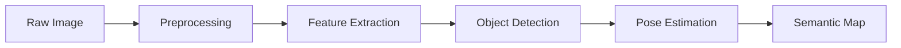
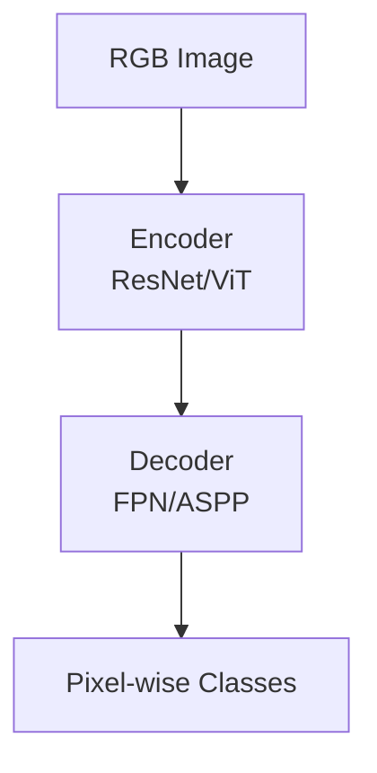
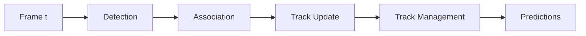
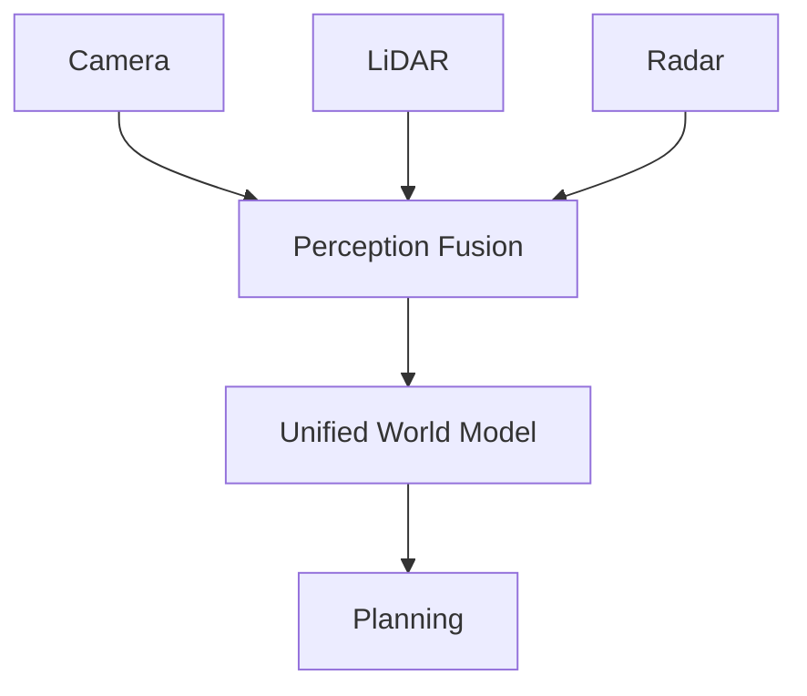

# Perception Systems


> **Why this matters:** A robot without perception is like a person with closed eyes. Perception transforms raw sensor data into actionable understanding.

## Introduction: Seeing the World

Perception in robotics answers three fundamental questions:

1. **What** is in the environment? (Object detection)
2. **Where** are things? (Localization and mapping)
3. **How** are things changing? (Tracking and prediction)

---

## Computer Vision Pipeline



### Object Detection

Modern detection uses deep learning:

| Model        | Speed   | Accuracy | Use Case          |
| ------------ | ------- | -------- | ----------------- |
| YOLOv8       | 150 FPS | mAP 50   | Real-time         |
| Faster R-CNN | 7 FPS   | mAP 42   | Accuracy-critical |
| DETR         | 28 FPS  | mAP 44   | End-to-end        |

```python
from ultralytics import YOLO

model = YOLO('yolov8n.pt')
results = model(frame)

for detection in results[0].boxes:
    cls = int(detection.cls)
    conf = detection.conf
    bbox = detection.xyxy[0]
    print(f"Detected {model.names[cls]} at {bbox} ({conf:.2f})")
```


---

## 3D Perception

### Point Cloud Processing

LiDAR and depth cameras produce point clouds:

```python
import open3d as o3d

# Load point cloud
pcd = o3d.io.read_point_cloud("scan.pcd")

# Downsample
pcd_down = pcd.voxel_down_sample(voxel_size=0.02)

# Remove outliers
pcd_clean, _ = pcd_down.remove_statistical_outlier(
    nb_neighbors=20, std_ratio=2.0
)

# Segment ground plane
plane_model, inliers = pcd_clean.segment_plane(
    distance_threshold=0.01,
    ransac_n=3,
    num_iterations=1000
)
```

### Depth Estimation

From stereo or monocular cameras:

```
Z = (f × B) / d
```

Where:

- `Z` = depth
- `f` = focal length
- `B` = baseline (stereo)
- `d` = disparity

---

## Semantic Understanding

### Scene Segmentation

Assign a class to every pixel:



### Scene Graphs

Represent relationships between objects:

```python
scene_graph = {
    "objects": [
        {"id": 1, "class": "table", "pose": T1},
        {"id": 2, "class": "cup", "pose": T2}
    ],
    "relationships": [
        {"subject": 2, "predicate": "on", "object": 1}
    ]
}
# "The cup is on the table"
```


---

## Pose Estimation

### Object Pose

Determine 6-DoF pose (position + orientation) of objects:

```python
# Using PoseNet or similar
def estimate_pose(rgb, depth, model):
    # Detect object mask
    mask = segment_object(rgb, model)

    # Extract point cloud
    object_points = depth_to_points(depth, mask)

    # Match to model
    transform = icp(object_points, model_points)

    return transform
```

### Human Pose

For human-robot interaction:

| Approach  | Joints | Speed   | Use Case      |
| --------- | ------ | ------- | ------------- |
| MediaPipe | 33     | 30+ FPS | Mobile        |
| OpenPose  | 25     | 10 FPS  | Full body     |
| HRNet     | 17     | 5 FPS   | High accuracy |

---

## Tracking and Prediction

### Multi-Object Tracking (MOT)



### Motion Prediction

Predicting where people/objects will go:

```python
class TrajectoryPredictor:
    def predict(self, history, horizon=2.0):
        """
        history: [(x, y, t), ...] past positions
        horizon: seconds to predict
        """
        # Simple: linear extrapolation
        velocity = self.estimate_velocity(history)
        future = [
            (history[-1][0] + velocity[0] * dt,
             history[-1][1] + velocity[1] * dt)
            for dt in np.arange(0, horizon, 0.1)
        ]
        return future
```

---

## Fusion Architecture

Combining multiple perception sources:



### Early vs. Late Fusion

| Strategy              | Pros             | Cons                   |
| --------------------- | ---------------- | ---------------------- |
| **Early** (raw data)  | Full information | Complex, compute heavy |
| **Late** (detections) | Simpler          | Loses information      |
| **Deep** (features)   | Best of both     | Training required      |

---

## Key Takeaways

:::note Summary

1. **Object detection** is solved with deep learning
2. **3D perception** uses point clouds and depth
3. **Semantic understanding** goes beyond detection
4. **Pose estimation** is crucial for manipulation
5. **Sensor fusion** combines strengths of each sensor
   :::

---

## Further Reading

- **Chapter 3.1**: [ROS 2 Concepts](/docs/module-03-software/ros2-concepts)
- **Chapter 3.2**: [Control Stack](/docs/module-03-software/control-stack)
- **Chapter 1.2**: [Sensors & State Estimation](/docs/module-01-foundations/sensors-state-estimation)
