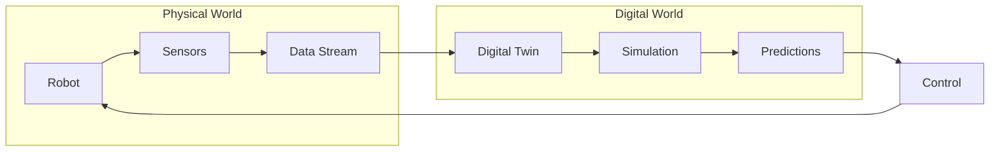
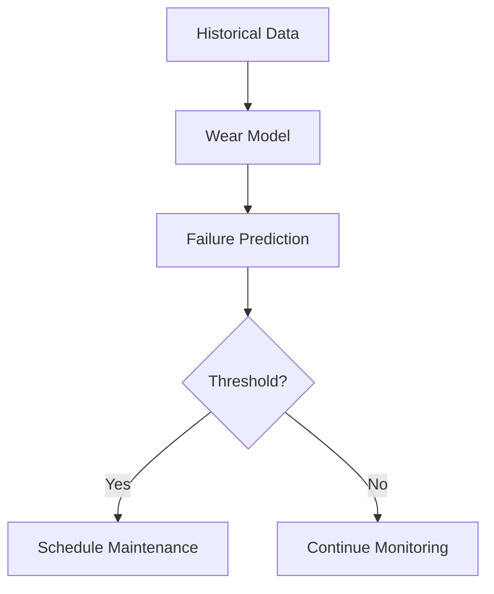

# Digital Twins


> **Why this matters:** A digital twin is a living, breathing simulation that mirrors the real robot. It enables testing, monitoring, and optimization without touching physical hardware.

## Introduction: The Virtual Mirror

A digital twin is not just a 3D model. It's a **synchronized virtual replica** that:

- Reflects real-time state from the physical robot
- Enables "what-if" scenarios
- Predicts failures before they happen
- Accelerates development by 10x

:::tip Industry Adoption
BMW, Tesla, and Amazon run digital twins of their entire factories. Before a single robot arm moves on the real floor, it has moved millions of times in simulation.
:::

---

## Architecture



### Data Flow

| Direction           | Data                      | Frequency |
| ------------------- | ------------------------- | --------- |
| Physical → Digital  | Joint states, sensor data | 100+ Hz   |
| Digital → Physical  | Commands, predictions     | 10-100 Hz |
| Digital → Analytics | Logs, metrics             | 1 Hz      |


---

## Building a Digital Twin

### Step 1: Create the URDF

The Universal Robot Description Format defines robot geometry:

```xml
<?xml version="1.0"?>
<robot name="humanoid">
  <link name="base_link">
    <visual>
      <geometry>
        <mesh filename="package://meshes/pelvis.stl"/>
      </geometry>
    </visual>
    <inertial>
      <mass value="10.0"/>
      <inertia ixx="0.1" iyy="0.1" izz="0.1"/>
    </inertial>
  </link>

  <joint name="hip_pitch" type="revolute">
    <parent link="base_link"/>
    <child link="thigh"/>
    <axis xyz="0 1 0"/>
    <limit lower="-1.57" upper="1.57" effort="200" velocity="5"/>
  </joint>
</robot>
```

### Step 2: Physics Engine Integration

Choose your simulation backend:

| Engine    | Best For          | Integration |
| --------- | ----------------- | ----------- |
| MuJoCo    | RL training       | Python, C   |
| Gazebo    | ROS 2             | Native      |
| Isaac Sim | Industrial        | USD, Python |
| PyBullet  | Quick prototyping | Python      |

### Step 3: Synchronization

```python
class DigitalTwin:
    def __init__(self, robot_urdf, physics_engine):
        self.sim = physics_engine.load(robot_urdf)
        self.ros_sub = rospy.Subscriber('/robot_state', JointState, self.update)

    def update(self, msg):
        """Sync physical state to simulation"""
        self.sim.set_joint_positions(msg.position)
        self.sim.set_joint_velocities(msg.velocity)

    def predict(self, command, horizon=1.0):
        """Predict future state given command"""
        self.sim.step_with_action(command, steps=int(horizon * 100))
        return self.sim.get_state()
```

---

## Use Cases

### 1. Predictive Maintenance

Monitor wear and predict failures:



### 2. What-If Scenarios

Test risky maneuvers safely:

- "What if we increase walking speed by 20%?"
- "What happens if foot slips during stairs?"
- "Can the arm reach that shelf?"

### 3. Training Data Generation

Generate millions of training examples:

```python
for _ in range(1_000_000):
    # Randomize scenario
    twin.randomize_environment()
    twin.randomize_robot_state()

    # Run simulation
    trajectory = twin.run_episode(policy)

    # Store for training
    dataset.add(trajectory)
```


---

## Tools & Platforms

### NVIDIA Omniverse

The industry standard for photorealistic digital twins:

- USD (Universal Scene Description) format
- RTX ray tracing
- Physics simulation
- Multi-user collaboration

### AWS IoT TwinMaker

Cloud-based digital twin platform:

- Connect to IoT data streams
- 3D scene visualization
- Integration with AWS analytics

### Unity Robotics Hub

Game engine for robotics:

- Real-time rendering
- ROS 2 integration
- Import URDF directly

---

## Key Takeaways

:::note Summary

1. **Digital twins** are synchronized virtual replicas
2. **Bidirectional data flow** keeps them in sync
3. **Predictive maintenance** prevents failures
4. **Training data generation** accelerates ML
5. **Modern platforms** (Omniverse, Unity) make this accessible
   :::

---

## Further Reading

- **Chapter 4.2**: [Benchmarks & Debugging](/docs/module-04-deployment/benchmarks-debug)
- **Chapter 4.3**: [Responsible Deployment](/docs/module-04-deployment/responsible-deployment)
- **Chapter 1.3**: [Simulation Basics](/docs/module-01-foundations/simulation-basics)
