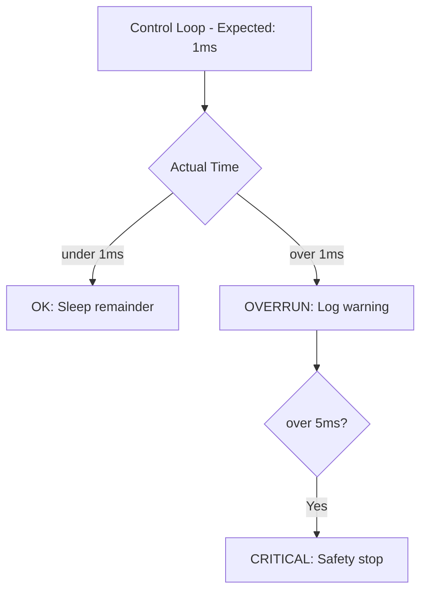

# Benchmarks & Debugging


> **Why this matters:** If you can't measure it, you can't improve it. Benchmarking and debugging are the keys to taking a robot from "works sometimes" to "production ready."

## Introduction: The Path to Reliability

Every robotics team has experienced the pain of a demo that works 9 times and fails spectacularly on the 10th. Systematic benchmarking transforms this chaos into engineering discipline.

---

## Performance Metrics

### What to Measure

| Category       | Metric                 | Target       |
| -------------- | ---------------------- | ------------ |
| **Control**    | Control loop frequency | 1000 Hz      |
| **Control**    | Tracking error (RMS)   | under 1 cm   |
| **Perception** | Detection latency      | under 33 ms  |
| **Perception** | Detection accuracy     | over 95%     |
| **Navigation** | Path following error   | under 5 cm   |
| **System**     | CPU utilization        | under 80%    |
| **System**     | Memory usage           | under 4 GB   |
| **Battery**    | Runtime                | over 4 hours |

### Measurement Infrastructure

```python
import time
from dataclasses import dataclass, field
from typing import List

@dataclass
class BenchmarkResult:
    name: str
    samples: List[float] = field(default_factory=list)

    @property
    def mean(self):
        return sum(self.samples) / len(self.samples)

    @property
    def p99(self):
        sorted_samples = sorted(self.samples)
        idx = int(0.99 * len(sorted_samples))
        return sorted_samples[idx]

class Profiler:
    def __init__(self):
        self.results = {}

    def profile(self, name):
        return ProfilerContext(self, name)

class ProfilerContext:
    def __enter__(self):
        self.start = time.perf_counter_ns()
        return self

    def __exit__(self, *args):
        elapsed = (time.perf_counter_ns() - self.start) / 1e6  # ms
        self.profiler.results[self.name].samples.append(elapsed)
```


---

## Debugging Strategies

### 1. Logging

Structured logging is essential:

```python
import logging
import json

class RobotLogger:
    def __init__(self, name):
        self.logger = logging.getLogger(name)
        self.logger.setLevel(logging.DEBUG)

    def log_state(self, state, level="info"):
        msg = json.dumps({
            "timestamp": time.time(),
            "joint_positions": state.q.tolist(),
            "joint_velocities": state.dq.tolist(),
            "is_stable": state.stable
        })
        getattr(self.logger, level)(msg)
```

### 2. Visualization

RViz2 markers for debugging:

```python
from visualization_msgs.msg import Marker

def publish_debug_marker(publisher, position, color="red"):
    marker = Marker()
    marker.header.frame_id = "world"
    marker.type = Marker.SPHERE
    marker.pose.position.x = position[0]
    marker.pose.position.y = position[1]
    marker.pose.position.z = position[2]
    marker.scale.x = marker.scale.y = marker.scale.z = 0.1

    colors = {"red": (1, 0, 0), "green": (0, 1, 0), "blue": (0, 0, 1)}
    marker.color.r, marker.color.g, marker.color.b = colors[color]
    marker.color.a = 1.0

    publisher.publish(marker)
```

### 3. Replay

Record and replay for debugging:

```bash
# Record all topics
ros2 bag record -a -o debug_session

# Play back at half speed
ros2 bag play debug_session --rate 0.5

# Play specific topics
ros2 bag play debug_session --topics /robot_state /camera/image
```

---

## Common Failure Modes

### Timing Issues



### State Estimation Drift

Track cumulative error over time:

```python
class DriftMonitor:
    def __init__(self, threshold=0.5):
        self.threshold = threshold
        self.checkpoints = []

    def check(self, estimated_pose, ground_truth):
        error = np.linalg.norm(
            estimated_pose[:3] - ground_truth[:3]
        )
        self.checkpoints.append({
            'time': time.time(),
            'error': error
        })

        if error > self.threshold:
            self.trigger_relocalization()
```


---

## Stress Testing

### Monte Carlo Testing

Run thousands of randomized scenarios:

```python
def monte_carlo_test(policy, n_trials=1000):
    results = []

    for i in range(n_trials):
        # Randomize initial conditions
        sim.reset()
        sim.randomize_terrain()
        sim.randomize_obstacles()

        # Run episode
        success = sim.run_episode(policy, max_steps=1000)
        results.append(success)

    success_rate = sum(results) / n_trials
    print(f"Success rate: {success_rate * 100:.1f}%")
    return success_rate
```

### Adversarial Testing

Push the robot to its limits:

- Maximum speed transitions
- Edge-case joint configurations
- Sudden obstacle appearance
- Communication dropouts

---

## Continuous Integration

### Robot CI Pipeline

```yaml
# .github/workflows/robot-ci.yml
name: Robot CI

on: [push, pull_request]

jobs:
  build:
    runs-on: ubuntu-22.04
    steps:
      - uses: actions/checkout@v4

      - name: Setup ROS 2
        uses: ros-tooling/setup-ros@v0.7
        with:
          required-ros-distributions: humble

      - name: Build
        run: |
          source /opt/ros/humble/setup.bash
          colcon build

      - name: Test
        run: |
          source install/setup.bash
          colcon test
          colcon test-result --verbose
```

---

## Key Takeaways

:::note Summary

1. **Measure everything**: Control frequency, errors, latency
2. **Structured logging** enables post-mortem analysis
3. **Visualization** makes abstract states concrete
4. **Replay** is your best debugging tool
5. **Monte Carlo testing** finds edge cases
6. **CI/CD** catches regressions early
   :::

---

## Further Reading

- **Chapter 4.1**: [Digital Twins](/docs/module-04-deployment/digital-twins)
- **Chapter 4.3**: [Responsible Deployment](/docs/module-04-deployment/responsible-deployment)
- **Chapter 3.2**: [Control Stack](/docs/module-03-software/control-stack)
