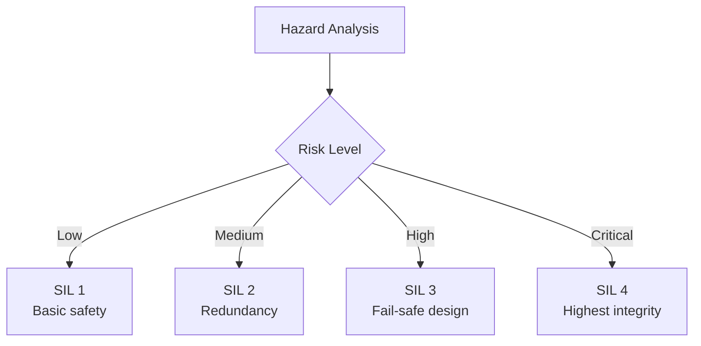
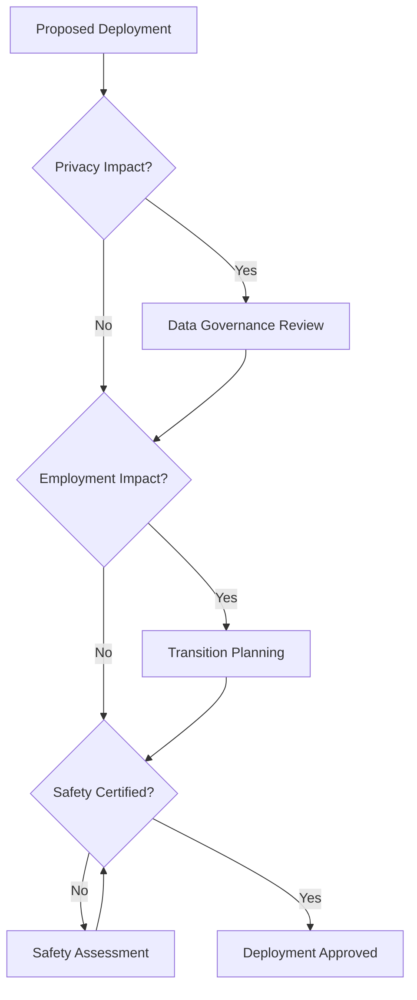

# Responsible Deployment


> **Why this matters:** Powerful robots require powerful responsibility. This chapter covers the ethical, safety, and societal considerations of deploying physical AI systems.

## Introduction: With Great Power...

A humanoid robot is not a smartphone app. It can physically interact with the world—and that means it can physically harm people, damage property, or have unintended consequences. Responsible deployment is not optional.

---

## Safety Standards

### ISO Standards for Robots

| Standard     | Scope                | Key Requirements           |
| ------------ | -------------------- | -------------------------- |
| ISO 10218    | Industrial robots    | Safety distances, guarding |
| ISO/TS 15066 | Collaborative robots | Force/power limiting       |
| ISO 13482    | Personal care robots | Risk assessment            |
| ISO 26262    | Automotive           | Functional safety levels   |

### Safety Integrity Levels (SIL)




---

## Risk Assessment

### Hazard Identification

| Hazard Type    | Example                | Mitigation                |
| -------------- | ---------------------- | ------------------------- |
| **Mechanical** | Pinch points, crushing | Guarding, force limits    |
| **Electrical** | Shock, fire            | Insulation, certification |
| **Software**   | Unexpected behavior    | Testing, watchdogs        |
| **Cyber**      | Hacking, data theft    | Encryption, hardening     |

### Risk Matrix

```python
class RiskAssessment:
    SEVERITY = {
        'negligible': 1,
        'minor': 2,
        'moderate': 3,
        'severe': 4,
        'catastrophic': 5
    }

    PROBABILITY = {
        'rare': 1,
        'unlikely': 2,
        'possible': 3,
        'likely': 4,
        'almost_certain': 5
    }

    def assess(self, hazard):
        risk_score = (
            self.SEVERITY[hazard.severity] *
            self.PROBABILITY[hazard.probability]
        )

        if risk_score > 15:
            return "UNACCEPTABLE - Redesign required"
        elif risk_score > 8:
            return "HIGH - Mitigation required"
        elif risk_score > 4:
            return "MEDIUM - Consider mitigation"
        else:
            return "LOW - Acceptable with monitoring"
```

---

## Human-Robot Interaction

### Separation Strategies

| Strategy         | Description           | Use Case              |
| ---------------- | --------------------- | --------------------- |
| **Spatial**      | Physical barriers     | High-speed industrial |
| **Temporal**     | Time-based access     | Maintenance windows   |
| **Speed/Force**  | Power limiting        | Collaborative work    |
| **Hand-Guiding** | Manual robot movement | Teaching              |

### Communication

Robots must communicate their intent:

```python
class IntentCommunicator:
    def __init__(self):
        self.led_controller = LEDController()
        self.speaker = AudioSystem()

    def signal_intent(self, action):
        if action == 'moving':
            self.led_controller.set_color('blue', pulsing=True)
            self.speaker.play_tone('moving_alert')
        elif action == 'stopping':
            self.led_controller.set_color('red', solid=True)
            self.speaker.play_tone('stop_chime')
        elif action == 'ready':
            self.led_controller.set_color('green', solid=True)
```


---

## Ethical Considerations

### Key Questions

1. **Displacement**: Will this robot replace human workers?
2. **Privacy**: Does it collect personal data?
3. **Autonomy**: Who is responsible for its decisions?
4. **Equity**: Who benefits and who is harmed?

### Ethical Framework



### Transparency

Document:

- What the robot can and cannot do
- How decisions are made
- How data is used
- How to report problems

---

## Deployment Checklist

### Pre-Deployment

- [ ] Complete risk assessment
- [ ] Pass safety certification
- [ ] Train operators and maintenance staff
- [ ] Establish emergency procedures
- [ ] Set up monitoring and logging
- [ ] Create incident response plan

### During Deployment

- [ ] Monitor performance metrics
- [ ] Review incident reports
- [ ] Update software safely
- [ ] Maintain safety systems
- [ ] Gather user feedback

### Continuous Improvement

```python
class DeploymentMonitor:
    def __init__(self):
        self.incidents = []
        self.near_misses = []
        self.feedback = []

    def log_incident(self, incident):
        self.incidents.append(incident)
        self.notify_safety_team(incident)

        if incident.severity > 3:
            self.pause_deployment()

    def generate_report(self):
        return {
            'incidents': len(self.incidents),
            'near_misses': len(self.near_misses),
            'uptime': self.calculate_uptime(),
            'recommendations': self.analyze_patterns()
        }
```

---

## Regulatory Landscape

### By Region

| Region    | Key Regulations             | Focus                    |
| --------- | --------------------------- | ------------------------ |
| **EU**    | AI Act, Machinery Directive | Risk-based, human rights |
| **US**    | OSHA, NIST AI RMF           | Workplace safety         |
| **China** | GB standards                | Industrial focus         |
| **Japan** | JIS standards               | Service robots           |

### Emerging Trends

- **AI transparency** requirements
- **Human oversight** mandates
- **Liability frameworks** for autonomous systems
- **Cybersecurity** regulations

---

## Key Takeaways

:::note Summary

1. **Safety is non-negotiable**: Follow ISO standards
2. **Risk assessment** must be systematic
3. **Human-robot interaction** requires clear communication
4. **Ethical considerations** extend beyond safety
5. **Regulatory compliance** varies by region
6. **Continuous monitoring** ensures ongoing safety
   :::

---

## Further Reading

- **Chapter 4.1**: [Digital Twins](/docs/module-04-deployment/digital-twins)
- **Chapter 4.2**: [Benchmarks & Debugging](/docs/module-04-deployment/benchmarks-debug)
- **Chapter 1.1**: [What is Physical AI?](/docs/module-01-foundations/what-is-physical-ai)

---

_"The goal is not to build robots that are safe. The goal is to build a world where robots make life better for everyone."_
