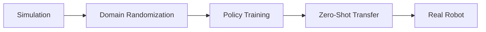

# Emerging Research in Humanoid Robotics


> **Why this matters:** The field of humanoid robotics is advancing at breakneck speed. Understanding emerging research helps you anticipate where the industry is heading.

## Introduction: The Research Frontier

Every year brings breakthroughs that seemed impossible just months before. From whole-body manipulation to learning from YouTube videos, research labs around the world are pushing boundaries.

---

## Key Research Areas

### 1. Foundation Models for Robotics

Large language models are coming to robots:

| Approach    | Description                        | Labs            |
| ----------- | ---------------------------------- | --------------- |
| **RT-X**    | Cross-embodiment training          | Google DeepMind |
| **PaLM-E**  | Embodied language models           | Google          |
| **Gato**    | Generalist agent                   | DeepMind        |
| **OpenVLA** | Open-source vision-language-action | Stanford        |

```python
# Conceptual: Using an LLM for robot planning
def plan_with_llm(task_description, scene_context):
    prompt = f"""
    Task: {task_description}
    Scene: {scene_context}

    Generate a step-by-step plan:
    """
    plan = llm.generate(prompt)
    return parse_plan(plan)
```

### 2. Learning from Human Videos

Training robots by watching humans:

- **Vid2Robot**: Learning manipulation from video
- **MimicPlay**: Imitation from play data
- **RoboMimic**: Large-scale imitation learning

### 3. Sim-to-Real Transfer

Closing the reality gap:



---

## Leading Research Labs

| Lab                              | Focus                    | Notable Work |
| -------------------------------- | ------------------------ | ------------ |
| **Tesla AI**                     | Humanoid for factories   | Optimus      |
| **Boston Dynamics AI Institute** | Dynamic locomotion       | Atlas        |
| **Figure AI**                    | General-purpose humanoid | Figure 01    |
| **1X Technologies**              | Safe human interaction   | NEO          |
| **Sanctuary AI**                 | Cognitive robotics       | Phoenix      |


---

## Open Problems

### Dexterous Manipulation

Human hands have 27 degrees of freedom. Current robot hands:

- Most: 5-12 DOF
- Challenge: In-hand manipulation
- Research: Tactile sensing, compliance

### Long-Horizon Planning

Robots struggle with tasks requiring:

- Multi-step reasoning
- Tool use
- Error recovery

### Human-Robot Collaboration

Making robots safe teammates:

- Intent prediction
- Natural communication
- Shared autonomy

---

## Key Takeaways

:::note Summary

1. **Foundation models** are transforming robot learning
2. **Video learning** enables training from human demonstrations
3. **Sim-to-real** transfer remains a critical challenge
4. **Dexterity** and **planning** are major open problems
5. **Collaboration** research focuses on safety and communication
   :::

---

## Further Reading

- **Chapter 5.2**: [Industry Trends](/docs/module-05-future/industry-trends)
- **Chapter 5.3**: [Career Paths](/docs/module-05-future/career-paths)
