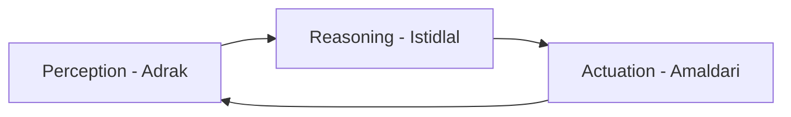

# Physical AI Kya Hai?

> **Zaroori Baat:** Physical AI sirf code nahi hai—yeh woh code hai jo hamare darmiyan chalta hai, kaam karta hai aur dunya ko mehsoos karta hai.

## Introduction: Software se Silicon Tak

Physical AI (jisay Embodied AI bhi kaha jata hai) Artificial Intelligence aur Robotics ka milap hai. Traditional AI (jaise LLMs ya chat-bots) sirf digital dunya mein hote hain, jabke Physical AI haqiqi, materi dunya mein maujood hoti hai.

Yeh "Dimagh" (AI) ko "Jism" (Hardware) dene ka naam hai.

:::info Yaad Rakhein
Agar AI chess khelta hai toh woh traditional AI hai. Agar AI chess ke mohron (pieces) ko hath se uthata hai aur apne opponent se hath milata hai, toh yeh **Physical AI** hai.
:::

---

## Physical AI Ke 3 Aham Sutoon (Pillars)

Physical Intelligence ko 3 bunyadi loops mein taqseem kiya ja sakta hai:

### 1. Perception (Adrak): Dunya Ko Dekhna
Robot apne sensors ke zariye yeh samajhta hai ke woh kahan hai aur uske aas paas kya hai. Is mein LiDAR, cameras, aur touch sensors shamil hain.

### 2. Reasoning (Istidlal): Dunya Ke Baare Mein Sochna
Data milne ke baad, AI faisla karti hai ke usay kya karna hai. Kya usay rukna chahiye? Ya usay kisi cheez ko pakarna chahiye?

### 3. Actuation (Amaldari): Dunya Mein Harakat Karna
Digital orders ko physical movement mein badalna. Yeh motors aur hydraulic systems ke zariye mumkin hota hai.

---

## Physical AI vs Traditional AI

| Features | Traditional AI (LLMs) | Physical AI (Robotics) |
| :--- | :--- | :--- |
| **Environment** | Web Data, Text | Physical World, Gravity |
| **Agent** | Servers, GPUs | Sensors, Motors, Robots |
| **Ghalti ka Natija** | Galat Jawab | Physical Damage, Accident |
| **Main Challenge** | Information Accuracy | Balance aur Safety |

---

## Hum Isay Ab Kyun Parh Rahe Hain?

Hum aik aise morr par hain jahan computing power aur hardware itne saste aur taqatwar ho gaye hain ke hum digital zehant ko madi dunya mein la sakte hain.

1. **Computing Power**: NVIDIA aur Tesla jaise idaray ab Physical AI ke liye khaas chips bana rahe hain.
2. **Data Ka Husool**: Hum ab lakhon ghanton ki human movement ka data robots ko sikha sakte hain.
3. **Cost Mein Kami**: Robotic hands aur sensors ab pehle se kahin zyada asani se mil rahe hain.

---

## Aham Nukat

:::note Khulasa (Summary)

1. **Physical AI** dimagh ko aik jism dene ka naam hai.
2. Yeh **Perception, Reasoning, aur Actuation** ke cycle par chalti hai.
3. Yeh traditional AI se zyada mushkil hai kyunke isay **Gravity** ka samna karna parta hai.
4. Future ke karkhane, hospitals aur ghar Physical AI par dependent honge.
   :::

---

## Mazeed Parhein

- **Chapter 1.2**: [Sensors aur State Estimation](/docs/module-01-foundations/sensors-state-estimation)
- **Chapter 1.3**: [Simulation ki Bunyadein](/docs/module-01-foundations/simulation-basics)
- **Chapter 2.1**: [Kinematics aur Dynamics](/docs/module-02-hardware/kinematics-dynamics)
