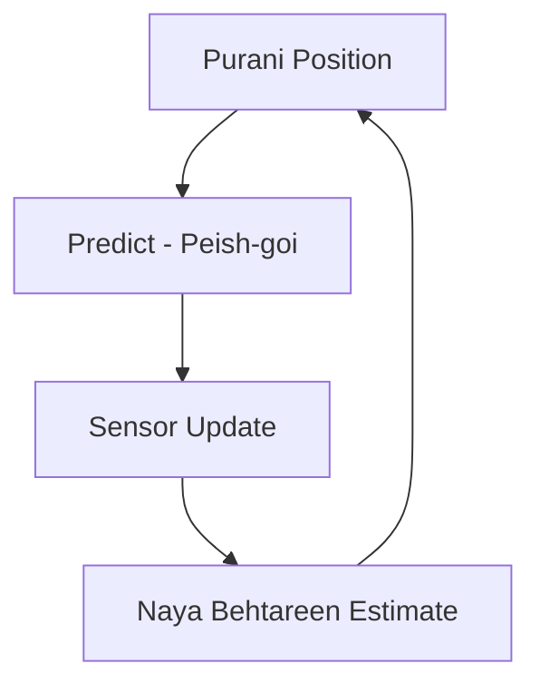

# Sensors aur State Estimation

> **Point ki Baat:** Agar AI dimagh hai, toh sensors uske hwaas (eyes, ears, aur touch) hain.

## Introduction: Robotic Hwaas (Senses)

Physical AI system ke liye sensors woh zariya hain jis se woh dunya ka data hasil karta hai. Lekin sirf raw data kafi nahi hota; usay samajhna aur "noise" se saaf karna zaroori hai.

### Aham Sensors

1. **Touch Sensors**: Dabao (pressure) aur texture mehsoos karne ke liye.
2. **LiDAR**: Laser ke zariye fasla (distance) naapne aur map banane ke liye.
3. **IMU (Inertial Measurement Unit)**: Balance aur speed ko naapne ke liye.
4. **Cameras (Vision)**: Cheezon ki pehchan aur depth samajhne ke liye.

---

## State Estimation: Noise se Sach Tak

Sensors kabhi bhi 100% sahi nahi hote. Un mein hamesha thora boht noise hota hai. State estimation woh maths hai jo sensors ke data ko mila kar robot ki sahi position batati hai.

### Kalman Filter

Kalman filter robotics mein sab se zyada use hone wala algorithm hai. Yeh purani information aur naye sensor data ko mila kar behtareen andaza (estimate) lagata hai.

---

## Sensor Fusion

Sensor fusion ka matlab hai ke hum sirf aik sensor par depend nahi karte balkay kai sensors ko milate hain.

- **Camera + LiDAR**: Camera pehchanta hai ke cheez kya hai, aur LiDAR batata hai ke woh kitni door hai.
- **IMU + Encoders**: Balance barqarar rakhne mein madad karte hain.

---

## Aham Nukat

:::note Khulasa (Summary)

1. **Sensors** Physical AI ki aankhein aur kaan hain.
2. **State Estimation** ghalat ya noisy data ko kaam ki cheez banati hai.
3. **Sensor Fusion** dunya ki aik mukammal picture banane mein madad karti hai.
4. **Kalman Filter** balance ke liye nihayat zaroori hai.
   :::

---

## Mazeed Parhein

- **Chapter 1.1**: [Physical AI Kya Hai?](/docs/module-01-foundations/what-is-physical-ai)
- **Chapter 1.3**: [Simulation ki Bunyadein](/docs/module-01-foundations/simulation-basics)
- **Chapter 3.3**: [Perception Systems](/docs/module-03-software/perception)
