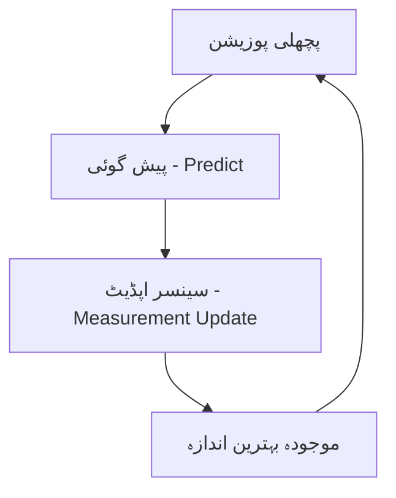

# سینسرز اور اسٹیٹ ایسٹیمیشن

> **خلاصہ:** اگر اے آئی (AI) دماغ ہے، تو سینسرز اس کے حواس (آنکھیں، کان، اور چھونے کی حس) ہیں۔

## تعارف: روبوٹک حواس

فزیکل اے آئی سسٹم کے لیے سینسرز وہ بنیادی ذریعہ ہیں جس سے وہ دنیا کا ڈیٹا حاصل کرتا ہے۔ لیکن خام ڈیٹا (Raw Data) کافی نہیں ہوتا؛ اسے سمجھنا اور شور (Noise) سے پاک کرنا ضروری ہے۔

### بنیادی سینسرز

1. **ٹچ سینسرز (Tactile Sensors)**: دباؤ اور ساخت کو محسوس کرنے کے لیے۔
2. **LiDAR**: لیزر کے ذریعے فاصلے ماپنے اور نقشہ بنانے کے لیے۔
3. **IMU (Inertial Measurement Unit)**: توازن، اسراع (Acceleration) اور زاویائی رفتار کو ماپنے کے لیے۔
4. **کیمرے (Vision)**: اشیاء کی شناخت اور گہرائی کو سمجھنے کے لیے۔

---

## اسٹیٹ ایسٹیمیشن (State Estimation): شور سے سچائی تک

سینسرز کبھی بھی 100% درست نہیں ہوتے۔ ان میں ہمیشہ "شور" (Noise) ہوتا ہے۔ اسٹیٹ ایسٹیمیشن وہ ریاضیاتی عمل ہے جو مختلف سینسرز کے ڈیٹا کو ملا کر روبوٹ کی صحیح پوزیشن معلوم کرتا ہے۔

### کالمان فلٹر (Kalman Filter)

کالمان فلٹر روبوٹکس کی دنیا میں سب سے زیادہ استعمال ہونے والا الگورتھم ہے۔ یہ ماضی کی معلومات اور موجودہ سینسر ڈیٹا کو ملا کر بہترین ممکنہ اندازہ (Estimate) لگاتا ہے۔

---

## سینسر فیوژن (Sensor Fusion)

سینسر فیوژن کا مطلب ہے کہ ہم صرف ایک سینسر پر بھروسہ نہیں کرتے۔

- **کیمرہ + LiDAR**: کیمرہ اشیاء کی شناخت کرتا ہے جبکہ LiDAR ان کا صحیح فاصلہ بتاتا ہے۔
- **IMU + انکوڈرز**: توازن برقرار رکھنے کے لیے تیز رفتار فیڈ بیک فراہم کرتے ہیں۔

---

## کلیدی نکات

:::note خلاصہ

1. **سینسرز** فزیکل اے آئی کی آنکھیں اور کان ہیں۔
2. **اسٹیٹ ایسٹیمیشن** شور زدہ ڈیٹا کو قابل استعمال معلومات میں بدلتی ہے۔
3. **سینسر فیوژن** مختلف حواس کو ملا کر ایک مکمل تصویر بناتی ہے۔
4. **کالمان فلٹر** روبوٹکس میں توازن اور پوزیشن کے لیے لازمی ہے۔
   :::

---

## مزید پڑھیں

- **باب 1.1**: [فزیکل اے آئی کیا ہے؟](/docs/module-01-foundations/what-is-physical-ai)
- **باب 1.3**: [سیمولیشن کی بنیادیں](/docs/module-01-foundations/simulation-basics)
- **باب 3.3**: [ادراک کے نظام](/docs/module-03-software/perception)
